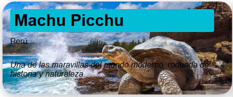
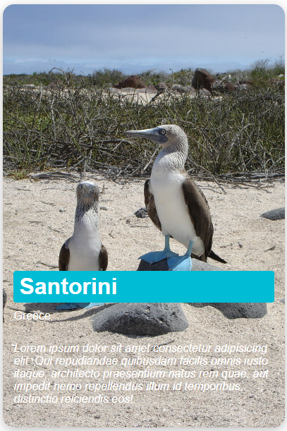

# 🌍 Travel Location Web Component

`<travel-location>` es un componente personalizado reutilizable desarrollado con **Web Components** y **Shadow DOM**, que permite mostrar ubicaciones turísticas o destinos de viaje con estilo, imagen de fondo y datos personalizables.

Este componente es ideal para sitios turísticos, blogs de viajes, catálogos o presentaciones visuales, y admite diferentes estilos mediante atributos HTML.

---

## ✨ Características

- Imagen de fondo personalizada
- Información dinámica (nombre, país, descripción)
- Soporte para orientación horizontal o vertical
- Estilos configurables desde atributos
- Encapsulamiento con Shadow DOM


---

## ⚙️ Atributos Personalizados

| Atributo            | Descripción                                                  | Ejemplo                  |
|---------------------|--------------------------------------------------------------|--------------------------|
| `name`              | Nombre del lugar turístico                                   | `name="Santorini"`       |
| `country`           | País o región correspondiente                                | `country="Greece"`       |
| `image`             | URL de la imagen de fondo                                    | `image="https://..."`    |
| `orientation`       | Dirección del diseño: `horizontal` o `vertical`              | `orientation="horizontal"` |
| `width`             | Ancho del componente                                         | `width="400px"`          |
| `height`            | Altura del componente                                        | `height="600px"`         |
| `shadow`            | Controla la sombra (`shadow` o `no-shadow`)                 | `shadow="no-shadow"`     |
| `border-radius`     | Radio de borde redondeado en px                              | `border-radius="16"`     |
| `image-rotation`    | Rotación de la imagen en grados                              | `image-rotation="5"`     |
| `title-bg-color`    | Color de fondo del título, admite rgb, hex, y colores definidos en el visual studio code                                    | `title-bg-color="#00bcd4"` |
| `title-color`       | Color del texto del título, admite rgb, hex, y colores definidos en el visual studio code                                   | `title-color="white"`    |
| `country-color`     | Color del texto del país, admite rgb, hex, y colores definidos en el visual studio code                                     | `country-color="white"`  |
| `description-color` | Color del texto de la descripción (slot)                     | `description-color="white"` |

---

## 💡 Uso del Componente

### 1. Incluir el script

```html
<script type="module" src="travel-location.js" defer></script>
```

### 2. Usar el componente en tu HTML

```html
<travel-location
  name="Lugar turistico"
  country="Pais"
  image="https://mi-imagen.jpg"
  orientation="horizontal"
  title-bg-color="#00bcd4"
  width="450px"
  shadow="shadow"
  border-radius="24"
>
  <p>Descripcion del lugar turistico</p>
</travel-location>
```

> El contenido dentro del `<travel-location>` se muestra en el slot como descripción.

---

## 🖼️ Ejemplo de la implementación del web component

### 📸 Ejemplo Horizontal
```html
<travel-location
    name="Machu Picchu"
    country="Perú"
    image="https://media.viajando.travel/p/f6c1afd28f13a4d893f2af36c93b2921/adjuntos/236/imagenes/000/745/0000745467/1200x675/smart/galapagosjpg.jpg"
    orientation="horizontal"
    title-bg-color="#00bcd4"
    width="450px"
    shadow="shadow"
    border-radius="24"
    >
    <p>Una de las maravillas del mundo moderno, rodeada de historia y naturaleza.</p>
</travel-location>
```

<p align="center">
  
</p>

---

### 📸 Ejemplo Vertical
```html
<travel-location
    name="Santorini"
    country="Greece"
    image="https://i0.hippopx.com/photos/381/1006/403/blue-footed-booby-galapagos-wildlife-ecuador-preview.jpg"
    orientation="vertical"
    width="400px"
    height="600px"
    border-radius="16"
    shadow="shadow"
    title-bg-color="#00bcd4"
    title-color="white"
    country-color="white"
    description-color="white"
    >
    <p>Lorem ipsum dolor sit amet consectetur adipisicing elit. Qui repudiandae quibusdam facilis omnis iusto itaque, architecto praesentium natus rem quae, aut impedit nemo repellendus illum id temporibus distinctio reiciendis eos!.</p>
</travel-location>
```

<p align="center">
  
</p>

---

## 🧪 Archivo travel-location.js

El componente está implementado usando la API de Web Components. A continuación se describen las partes clave:

- **Constructor**: Crea el shadow DOM e inserta un template con estilos y estructura.
```js
class TravelLocation extends HTMLElement {
  constructor() {
    super();
    this.attachShadow({ mode: 'open' });

    const template = document.createElement('template');
}
```
- **Atributos Observados**: El componente escucha cambios en atributos como `image`, `name`, `country`, `width`, entre otros.
```js
static get observedAttributes() {
    return [
      'name', 'country', 'image', 'orientation', 'shadow', 'border-radius', 
      'image-rotation', 'title-bg-color', 'title-color', 'country-color', 'description-color',
      'width', 'height'
    ];
}
```
- **attributeChangedCallback**: Permite actualizar el estilo y contenido del componente cuando cambian los atributos HTML.
```js
attributeChangedCallback(name, oldValue, newValue) {
    const container = this.shadowRoot.querySelector('.container');
    const nameEl = this.shadowRoot.getElementById('name');
    const countryEl = this.shadowRoot.getElementById('country');
    const slot = this.shadowRoot.querySelector('slot');
}
```

Ejemplo de actualización dinámica en el componente:

```js
case 'image':
  container.style.backgroundImage = `url(${newValue})`;
```

Esto permite cambiar dinámicamente la imagen de fondo desde el HTML.

---
## 🧪 Demo en index.html

El archivo [`index.html`](./index.html) incluye varios ejemplos de uso en distintas configuraciones.

---